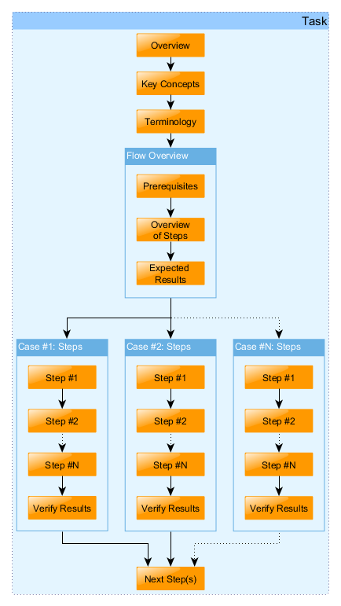

## Welcome to GitHub Pages

You can use the [editor on GitHub](https://github.com/trexdog/graph-test/edit/master/index.md) to maintain and preview the content for your website in Markdown files.

Whenever you commit to this repository, GitHub Pages will run [Jekyll](https://jekyllrb.com/) to rebuild the pages in your site, from the content in your Markdown files.

### Markdown

Markdown is a lightweight and easy-to-use syntax for styling your writing. It includes conventions for

```markdown
Syntax highlighted code block

# Header 1
## Header 2
### Header 3

- Bulleted
- List

1. Numbered
2. List

**Bold** and _Italic_ and `Code` text

[Link](url) and 
```

For more details see [GitHub Flavored Markdown](https://guides.github.com/features/mastering-markdown/).

### Jekyll Themes

Your Pages site will use the layout and styles from the Jekyll theme you have selected in your [repository settings](https://github.com/trexdog/graph-test/settings). The name of this theme is saved in the Jekyll `_config.yml` configuration file.

### Support or Contact

Having trouble with Pages? Check out our [documentation](https://help.github.com/categories/github-pages-basics/) or [contact support](https://github.com/contact) and we’ll help you sort it out.


# TEST graph image with javascript

<script type="text/javascript">
tooltip = null;
document.onmousemove = updateTooltip;
function updateTooltip(e) {
try {
if (document.all) {
if (document.documentElement && document.documentElement.scrollTop) { // Explorer 6 Strict
x = document.documentElement.scrollLeft + window.event.x;
y = document.documentElement.scrollTop + window.event.y;
}
else { // all other Explorers
x = document.body.scrollLeft + window.event.x;
y = document.body.scrollTop + window.event.y;
}
}
else {
x = e.pageX;
y = e.pageY;
}
if (tooltip != null) {
o = 20;
var sx, sy;
if (self.pageYOffset) { // all except Explorer
sx = self.pageXOffset;
sy = self.pageYOffset;
}
else if (document.documentElement && document.documentElement.scrollTop) { // Explorer 6 Strict
sx = document.documentElement.scrollLeft;
sy = document.documentElement.scrollTop;
}
else if (document.body) { // all other Explorers
sx = document.body.scrollLeft;
sy = document.body.scrollTop;
}
t = y + o + tooltip.offsetHeight;
w = sy + document.body.clientHeight;
if (t > w) {
y = y - o - tooltip.offsetHeight;
}
else {
y = y + o;
}
t = x + o + tooltip.offsetWidth;
w = sx + document.body.clientWidth;
if (t > w) {
x = x - o - tooltip.offsetWidth;
}
else {
x = x + o;
}
if ((tooltip.style.top == '' || tooltip.style.top == 0) && (tooltip.style.left == '' || tooltip.style.left == 0))
{
tooltip.style.width = tooltip.offsetWidth + 'px';
tooltip.style.height = tooltip.offsetHeight + 'px';
}
tooltip.style.left = x + "px";
tooltip.style.top = y + "px";
}
} catch (error) { error = null; }
}
function showTooltip(id) {
try {
tooltip = document.getElementById(id);
tooltip.style.display = "block";
} catch (error) { error = null; }
}
function hideTooltip() {
try {
tooltip.style.display = "none";
} catch (error) { error = null; }
}
</script>

<div class="tooltip" id="n0">Task</div>
<div class="tooltip" id="n1">Overview</div>
<div class="tooltip" id="n2">Key Concepts</div>
<div class="tooltip" id="n3">Terminology</div>
<div class="tooltip" id="n4">Flow Overview</div>
<div class="tooltip" id="n5">Case #1: Steps </div>
<div class="tooltip" id="n6">Next Steps</div>
<div class="tooltip" id="n7">Prerequisites</div>
<div class="tooltip" id="n8">Overview<br>of Steps</div>
<div class="tooltip" id="n9">Expected <br>Results</div>
<div class="tooltip" id="n10">Case #2: Steps </div>
<div class="tooltip" id="n11">Case #N: Steps </div>
<div class="tooltip" id="n12">Step #1</div>
<div class="tooltip" id="n13">Step #2</div>
<div class="tooltip" id="n14">Step #N</div>
<div class="tooltip" id="n15">Verify Results</div>
<div class="tooltip" id="n16">Step #1</div>
<div class="tooltip" id="n17">Step #2</div>
<div class="tooltip" id="n18">Step #N</div>
<div class="tooltip" id="n19">Verify Results</div>
<div class="tooltip" id="n20">Step #1</div>
<div class="tooltip" id="n21">Step #2</div>
<div class="tooltip" id="n22">Step #N</div>
<div class="tooltip" id="n23">Verify Results</div>

<map name="image1_1">
  <area shape="rect" coords="311,631,398,661" alt="" onmouseover="showTooltip('n23')" onmouseout="hideTooltip()"/>
  <area shape="rect" coords="311,575,398,605" alt="" onmouseover="showTooltip('n22')" onmouseout="hideTooltip()"/>
  <area shape="rect" coords="311,520,398,550" alt="" onmouseover="showTooltip('n21')" onmouseout="hideTooltip()"/>
  <area shape="rect" coords="311,464,398,494" alt="" onmouseover="showTooltip('n20')" onmouseout="hideTooltip()"/>
  <area shape="rect" coords="296,431,413,676" alt="" onmouseover="showTooltip('n11')" onmouseout="hideTooltip()"/>
  <area shape="rect" coords="173,631,260,661" alt="" onmouseover="showTooltip('n19')" onmouseout="hideTooltip()"/>
  <area shape="rect" coords="173,575,260,605" alt="" onmouseover="showTooltip('n18')" onmouseout="hideTooltip()"/>
  <area shape="rect" coords="173,520,260,550" alt="" onmouseover="showTooltip('n17')" onmouseout="hideTooltip()"/>
  <area shape="rect" coords="173,464,260,494" alt="" onmouseover="showTooltip('n16')" onmouseout="hideTooltip()"/>
  <area shape="rect" coords="158,431,275,676" alt="" onmouseover="showTooltip('n10')" onmouseout="hideTooltip()"/>
  <area shape="rect" coords="35,631,122,661" alt="" onmouseover="showTooltip('n15')" onmouseout="hideTooltip()"/>
  <area shape="rect" coords="35,575,122,605" alt="" onmouseover="showTooltip('n14')" onmouseout="hideTooltip()"/>
  <area shape="rect" coords="35,520,122,550" alt="" onmouseover="showTooltip('n13')" onmouseout="hideTooltip()"/>
  <area shape="rect" coords="35,464,122,494" alt="" onmouseover="showTooltip('n12')" onmouseout="hideTooltip()"/>
  <area shape="rect" coords="20,431,137,676" alt="" onmouseover="showTooltip('n5')" onmouseout="hideTooltip()"/>
  <area shape="rect" coords="173,721,260,751" href="URLtoNextStep" alt="" onmouseover="showTooltip('n6')" onmouseout="hideTooltip()" target="_blank"/>
  <area shape="rect" coords="173,332,260,362" alt="" onmouseover="showTooltip('n9')" onmouseout="hideTooltip()"/>
  <area shape="rect" coords="173,277,260,307" alt="" onmouseover="showTooltip('n8')" onmouseout="hideTooltip()"/>
  <area shape="rect" coords="173,221,260,251" alt="" onmouseover="showTooltip('n7')" onmouseout="hideTooltip()"/>
  <area shape="rect" coords="158,188,275,379" alt="" onmouseover="showTooltip('n4')" onmouseout="hideTooltip()"/>
  <area shape="rect" coords="173,139,260,169" alt="" onmouseover="showTooltip('n3')" onmouseout="hideTooltip()"/>
  <area shape="rect" coords="173,91,260,121" alt="" onmouseover="showTooltip('n2')" onmouseout="hideTooltip()"/>
  <area shape="rect" coords="173,42,260,72" alt="" onmouseover="showTooltip('n1')" onmouseout="hideTooltip()"/>
  <area shape="rect" coords="15,15,418,756" alt="" onmouseover="showTooltip('n0')" onmouseout="hideTooltip()"/>
</map>


    <table class="yimagetable" cellspacing="0" cellpadding="0" border="0">
      <tr>
        <td></td>
      </tr>
    </table>
